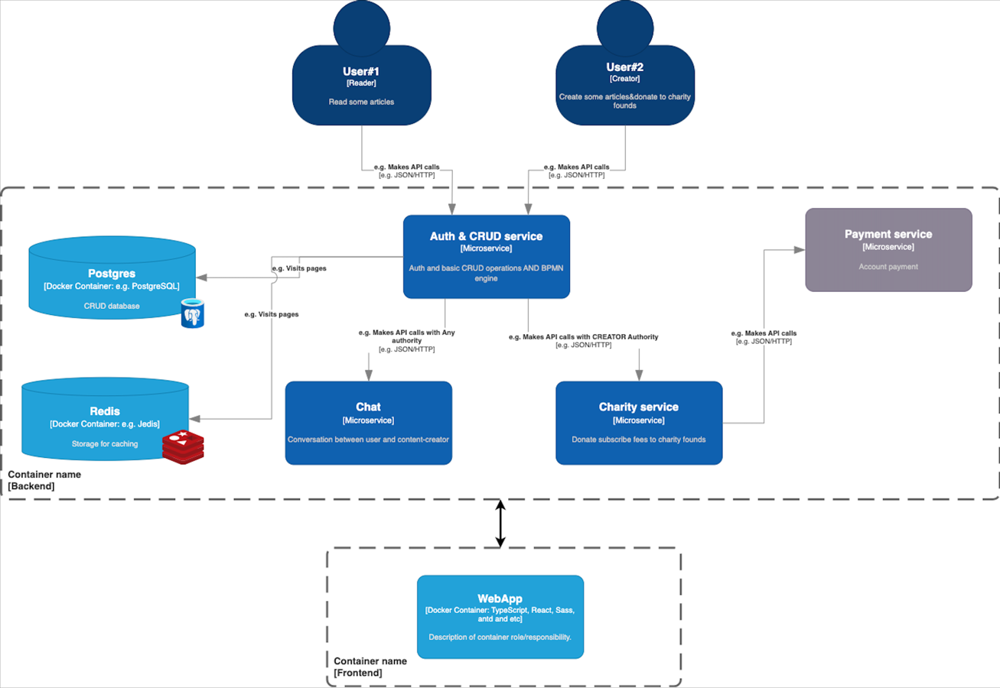
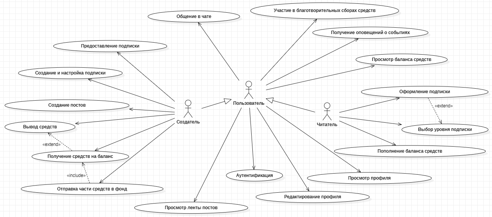
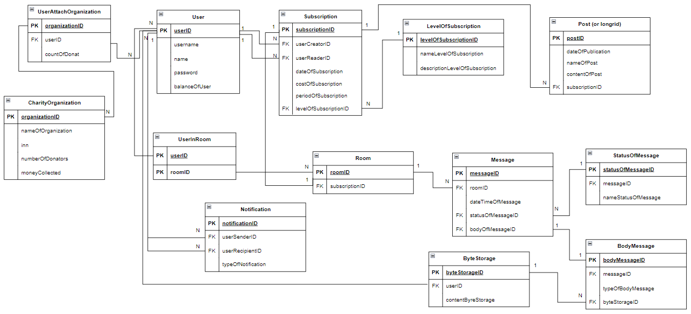

# Благотворительная платформа (TBD)
## Проектная мастерская лето/24.
## Team
* Стружанов Фёдор (Backend)
* Кирюшкин Кирилл (Backend)
* Золотов Георгий (Backend)
* Сапунов Максим (Frontend)
* Бурмистрова Виктория (System Analyst)

## C4 Diagram

## Use Case
Пользователь может иметь роли Создателя и Читателя.   

_Создатель - пользователь, который может создавать посты._   
_Читатель - пользователь, который просматривает посты._    

## ER-diagram

### API Documentation (Swagger)
В процессе разработки доступна документация REST API бэкенда - Swagger UI.
Доступ к swagger осуществляется к каждому микросервису отдельно по следующему принципу:
    
    <host>:<port>/swagger-ui/index.html
где host - адрес хоста, port - порт на котором работает микросервис

    Пример: http://localhost:8002/swagger-ui/index.html

### Some documentation
* [Official Apache Maven documentation](https://maven.apache.org/guides/index.html)
* [Spring Boot Maven Plugin Reference Guide](https://docs.spring.io/spring-boot/docs/3.3.0/maven-plugin/reference/html/)
* [Create an OCI image](https://docs.spring.io/spring-boot/docs/3.3.0/maven-plugin/reference/html/#build-image)
* [Spring Data JPA](https://docs.spring.io/spring-boot/docs/3.3.0/reference/htmlsingle/index.html#data.sql.jpa-and-spring-data)
* [Liquibase Migration](https://docs.spring.io/spring-boot/docs/3.3.0/reference/htmlsingle/index.html#howto.data-initialization.migration-tool.liquibase)
* [Spring Security](https://docs.spring.io/spring-boot/docs/3.3.0/reference/htmlsingle/index.html#web.security)
* [Spring Web](https://docs.spring.io/spring-boot/docs/3.3.0/reference/htmlsingle/index.html#web)
* [WebSocket](https://docs.spring.io/spring-boot/docs/3.3.0/reference/htmlsingle/index.html#messaging.websockets)

### Guides
The following guides illustrate how to use some features concretely:

* [Accessing Data with JPA](https://spring.io/guides/gs/accessing-data-jpa/)
* [Securing a Web Application](https://spring.io/guides/gs/securing-web/)
* [Spring Boot and OAuth2](https://spring.io/guides/tutorials/spring-boot-oauth2/)
* [Authenticating a User with LDAP](https://spring.io/guides/gs/authenticating-ldap/)
* [Building a RESTful Web Service](https://spring.io/guides/gs/rest-service/)
* [Serving Web Content with Spring MVC](https://spring.io/guides/gs/serving-web-content/)
* [Building REST services with Spring](https://spring.io/guides/tutorials/rest/)
* [Using WebSocket to build an interactive web application](https://spring.io/guides/gs/messaging-stomp-websocket/)